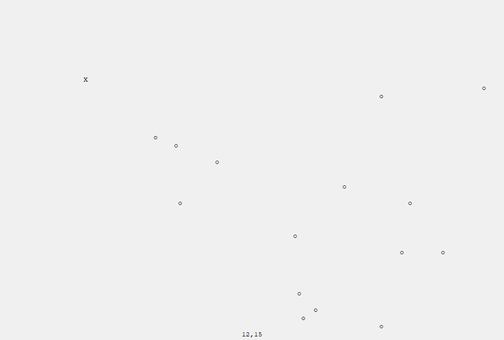
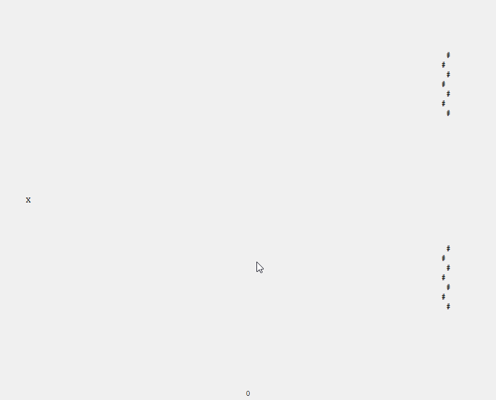
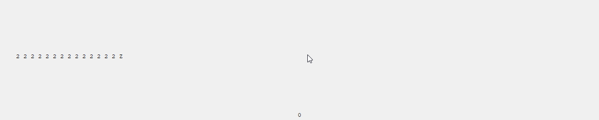

# Classes in the hexagrid package

HexaGrid is a class which provides a two-dimensional hexagonal grid. It is realised as a two-dimensional array, whose odd rows (i.e. every second row) are interpreted as being shifted half a lattice size to the right. Each grid site is described by a cell, which stores a parameter (or other properties) and its associated cartesian coordinates corresponding to the row and column of the underlying array. Relative positions of cells are described by the six directions W, NW, NE, E, SE and SW. The most basic method takes a cell and a direction as arguments and returns the cell lying in the given direction from the given cell.

Agent is a class which has a HexaGrid instance and a position (associated cartesian coordinates) as instance variables. Typical methods include moving and performing various scans, collecting the parameters of surrounding cells. Methods for decision making are typically implemented in child classes. Instances of Agent therefore provide models for autonomously acting subjects, like robots or simplified animals. 

Examples for specific simulations are implemented in the modules in the simulations package. They can be run by executing the ...\_app.py files in the console (these use the class App contained in the hexagrid package, which repeats and displays the simulation steps on a tkinter window).

# Example simulations

## Predator
One example is a simple predator, who in each step scans its surrounding for the nearest prey and makes one step in the appropriate direction (random choice between ambiguous possibilities). The prey agents move randomly in a smooth way, i.e. with a deviation from the previous direction of maximally one (if possible), and never onto the predator.

## Ants
Another example is a model for the pathfinding mechanism of ants, which leave a track of scent of a certain strength evaporating at a certain rate. An ant moves to an adjacent cell of maximum strength in eastern (NE,E,SE) direction with a certain high probability, and else to a randomly chosen cell in eastern direction. If an ant encounters a target, it starts to move in the western direction, this time being determined to follow the strongest track and leaving a stronger scent than before. If it ends at the original starting point, it is re-included in the general ant pool. In many cases, the formation of relatively short tracks of very high strength to the targets can be observed.

## Duck family
Another example is a duck family consisting of a parent and a number of following children. In each step, the mother moves randomly in one of the three forward directions NE, E or SE. The subsequent child performs a radial scan of radius two and moves, if neccessary, in order to close up to the mother (random choice between ambiguous moving directions). The same is perfomed by each subsequent child with respect to the duck in front.

